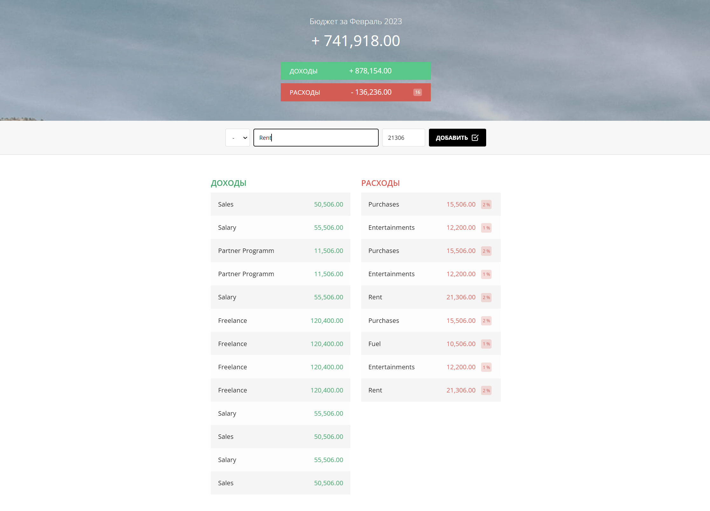

<!-- Improved compatibility of back to top link: See: https://github.com/othneildrew/Best-README-Template/pull/73 -->

<!-- PROJECT LOGO -->
 

  

  <h3 align="center">Budjet calc App</h3>

  

    Application for accounting expenses and income using MVC architecture
     
     
  

<h2 align="center"><a  href="https://ruslankharisov.github.io/budget_calc/">Live Demo</a></h2>
 

<h2 align="center"> Built With </h2>

  
    
  
    
  
  

## Contact

Ruslan Kharisov - ruslan.kharisov@gmail.com

Project Link: [https://ruslankharisov.github.io/budget_calc/](https://ruslankharisov.github.io/budget_calc/)
  

(<a href="#readme-top">back to top</a>)

